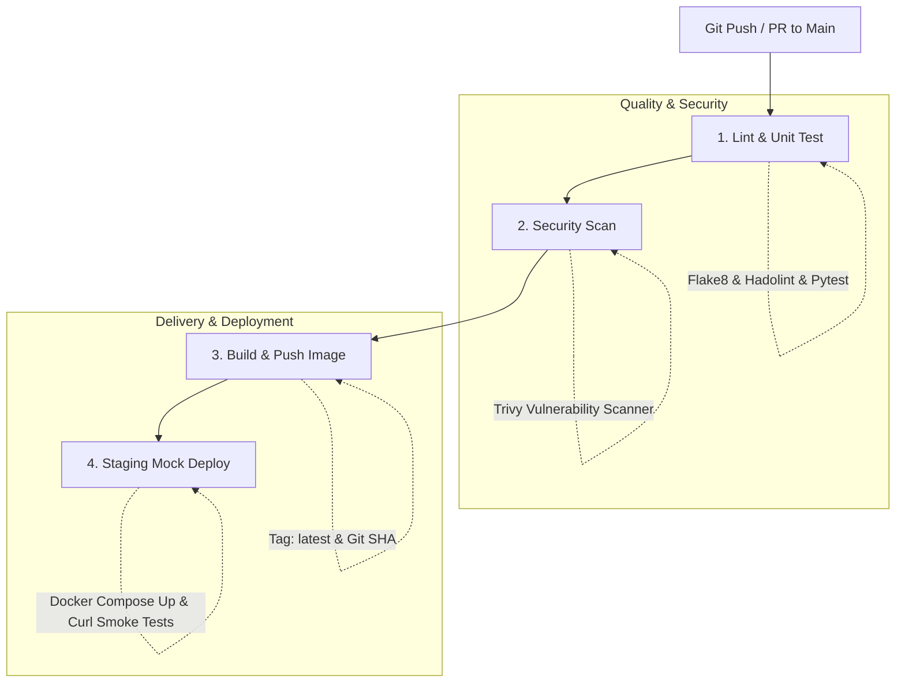

```markdown
این پروژه پیاده‌سازی کامل یک پایپ‌لاین یکپارچه‌سازی و استقرار مداوم (CI/CD) استاندارد، امن و تست‌محور با استفاده از **GitHub Actions** است. معماری سرویس شامل یک استک ۳ لایه‌ای (Nginx Reverse Proxy + Flask Backend + Redis Cache) بوده که به صورت کامپوز‌شده اجرا می‌شود.

---

## 🏗️ معماری سیستم و سرویس‌ها

معماری برنامه به گونه‌ای طراحی شده که ترافیک ورودی مستقیماً به وب‌اپلیکیشن نمی‌رسد، بلکه از یک پراکسی معکوس عبور می‌کند:


```

[کاربر / کلاینت] ──(Port 80)──► [ Nginx Proxy ]
│ (Reverse Proxy)
▼
[ Flask Backend ] ──► [ Redis In-Memory DB ]
(Port 5000 / Internal)   (Port 6379 / Internal)

```

1. **Nginx:** درگاه ورودی (Reverse Proxy) برای مدیریت درخواست‌های HTTP و فوروارد ترافیک به وب‌سرور داخلی.
2. **Flask Backend:** هسته پایتونی برنامه با قابلیت ارائه صفحات داینامیک، روت ارزیابی سلامت (`/health`) و اتصال به ردیس.
3. **Redis:** پایگاه‌داده In-Memory جهت ثبت شمارنده بازدیدها (Page Views) به صورت زنده و نمایش در داشبورد کاربری.

---

## 🔄 مراحل پایپ‌لاین CI/CD

پایپ‌لاین در مسیر `.github/workflows/ci-cd.yml` به ۴ مرحله‌ی مجزا و پیوسته تفکیک شده است:



### ۱. ارزیابی کد و تست‌ها (Lint & Unit Test)

* **بررسی سینتکس پایتون:** با ابزار `flake8` برای اطمینان از خوانایی و عدم وجود خطاهای ساختاری.
* **لینت داکرفایل:** با استفاده از `hadolint` برای رعایت استانداردهای کانتینرسازی بهینه.
* **تست‌های واحد (Unit Tests):** اجرای تست‌های خودکار با `pytest` جهت تایید صحت روت `/health` و لود موفق قالب صفحات.

### ۲. اسکن آسیب‌پذیری امنیتی (Security Scan)

* بیلد موقت ایمیج داکر در محیط رانر.
* تحلیل و اسکن لایه‌های ایمیج با ابزار استاندارد **Trivy** جهت یافتن آسیب‌پذیری‌های امنیتی بحرانی (CRITICAL & HIGH).

### ۳. ساخت و رجیستری ایمیج (Build & Push)

* ایجاد ایمیج نهایی چندمرحله‌ای (Multi-stage) با **Docker Buildx**.
* برچسب‌گذاری (Tagging) دوگانه: تگ `latest` و تگ اختصاصی متناظر با هش هر کامیت (`${{ github.sha }}`) برای ردیابی دقیق و امکان رول‌بک (Rollback).
* ارسال ایمیج به مخزن ابری **Docker Hub**.

### ۴. شبیه‌سازی دیپلوی و تست دود (Staging Mock Deploy)

* فراخوانی ایمیج ساخته‌شده از داکر هاب با تگ متناظر کامیت فعلی.
* بالا آوردن کل استک چندکانتینری با دستور `docker compose up -d` روی ماشین رانر گیت‌هاب Actions.
* اجرای تست‌های نهایی (Smoke Tests) با استفاده از `curl -f` جهت بررسی لایه پراکسی Nginx و اندپوینت سلامت بدون وابستگی به سرور فیزیکی.
* پاک‌سازی و تخریب محیط (Tear down) پس از اتمام تست‌ها.

---

## 📁 ساختار مخزن

```text
├── .github/
│   └── workflows/
│       └── ci-cd.yml         # کانفیگ گردش کار GitHub Actions
├── src/
│   ├── app.py                # برنامه بک‌اند فلسک
│   └── requirements.txt      # نیازمندی‌های پایتون (Flask, Redis)
├── templates/
│   └── index.html            # قالب UI داشبورد وضعیت سیستم
├── tests/
│   └── test_app.py           # تست‌های واحد Pytest
├── .dockerignore             # جلوگیری از انتقال کش و فولد .venv به کانتینر
├── Dockerfile                # داکرفایل چندمرحله‌ای (Multi-Stage) با کاربر Non-root
├── docker-compose.yml        # ارکستراسیون سه سرویس (Nginx, App, Redis)
├── nginx.conf                # پیکربندی پروکسی معکوس انجین‌ایکس
└── README.md

```

---

## ⚙️ متغیرهای محرمانه مورد نیاز در گیت‌هاب (GitHub Secrets)

برای فعال‌سازی بخش رجیستری پایپ‌لاین، متغیرهای زیر باید در بخش **Settings > Secrets and variables > Actions** تعریف شوند:

| متغیر | شرح |
| --- | --- |
| `DOCKERHUB_USERNAME` | نام کاربری اکانت شما در پلتفرم Docker Hub |
| `DOCKERHUB_TOKEN` | توکن دسترسی (Personal Access Token) با مجوز Read & Write |

---

## 💻 راه‌اندازی و اجرای لوکال

برای تست و اجرای مستقیم پروژه روی سیستم خود (نیاز به Docker Desktop):

۱. ریپازیتوری را کلون کنید:

```bash
git clone [https://github.com/arian-0058/automated-ci-cd-pipeline.git](https://github.com/arian-0058/automated-ci-cd-pipeline.git)
cd automated-ci-cd-pipeline

```

۲. استک کانتینری را بیلد و اجرا کنید:

```bash
docker compose up --build -d

```

۳. مرورگر را باز کرده و وضعیت را مشاهده کنید:

* **داشبورد گرافیکی:** `http://localhost`
* **آدرس هلث‌چک:** `http://localhost/health`

۴. اجرای تست‌های محلی:

```bash
pytest tests/ -v

```

۵. متوقف کردن سرویس‌ها:

```bash
docker compose down

```

---

## 🛡️ اصول و الگوهای رعایت‌شده دواپس (DevOps Practices)

* **Multi-Stage Build:** تفکیک محیط Build و Run برای کمینه کردن حجم نهایی ایمیج و افزایش سرعت بارگذاری.
* **Non-Root Execution:** اجرای کانتینر تحت یوزر اختصاصی `appuser` جهت ارتقای امنیت کانتینر.
* **Layer Caching:** کپی زودهنگام `requirements.txt` در داکرفایل به منظور استفاده حداکثری از کش لایه‌ها در زمان بیلد مجدد.
* **Shift-Left Security:** ادغام ابزارهای ارزیابی امنیتی (Hadolint و Trivy) قبل از مرحله انتشار رسمی ایمیج.
* **Mock Deployment Automation:** تضمین عملکرد صحیح کل پشته نرم‌افزاری پیش از انتشار نهایی از طریق تست‌های یکپارچگی روی رانر.

```

```

---

## 🛠️ گزارش چالش‌ها و عیب‌یابی (Troubleshooting & Case Studies)

مستندسازی خطاهای واقعی رخ‌داده در فرآیند اجرای پایپ‌لاین CI/CD و متدولوژی حل آن‌ها جهت ارتقای پایداری سیستم[cite: 1]:

### ۱. خطای لینتر پایتون و عدم شناسایی پوشه تست در رانر

* **مشکل (Problem):** توقف مرحله `lint-and-test` به دلیل خطاهای استایل کد پایتون و عدم دسترسی به مسیر فایل‌های تست.
* **علائم (Symptoms):** 
  * خروج پایپ‌لاین با کد `Process completed with exit code 1`.
  * مشاهده خطای `E902 FileNotFoundError: [Errno 2] No such file or directory: 'tests/'`.
  * مشاهده هشدار استایل `src/app.py:40:39: W292 no newline at end of file`.
* **علت ریشه‌ای (Root Cause):**
  * پوشه `tests/` به دلیل عدم کامیت فایل داخل آن به مخزن گیت اضافه نشده بود (گیت پوشه‌های خالی را ترک نمی‌کند)؛ در نتیجه رانر گیت‌هاب دایرکتوری تست را پیدا نمی‌کرد.
  * نبود یک کاراکتر خط جدید (Newline) در انتهای فایل `src/app.py` که بر خلاف استاندارد PEP 8 است.
* **راه‌حل (Fix):**
  * افزودن خط خالی پایانی به فایل `src/app.py`.
  * ایجاد و اضافه کردن قطعی فایل `tests/test_app.py` با دستورات `git add` و `git commit`.
  * به‌روزرسانی پارامترهای Flake8 در فایل ورک‌فلو جهت نادیده‌گرفتن خطاهای جزئی فاصله‌گذاری (`--ignore=E501,E302,E305,W291,W292,W293`).
* **درس آموخته‌شده (Lesson Learned):** 
  * محیط‌های رانر CI/CD کاملاً ایزوله هستند و تنها دایرکتوری‌هایی را می‌بینند که در گیت ردگیری شده باشند.
  * همیشه پیش از پوش، بررسی خروجی `git status` و آزمایش ابزارهای Linting در محیط محلی الزامی است.

---

### ۲. شکست بیلد ایمیج داکر ناشی از تداخل مسیر پوشه قالب‌ها

* **مشکل (Problem):** توقف اجرای داکرفایل در مرحله اسکن امنیتی و بیلد ایمیج به دلیل پیدا نشدن مسیر سورس در دستور `COPY`.
* **علائم (Symptoms):**
  * شکست بیلد با خطای:
    `ERROR: failed to solve: failed to compute cache key: failed to calculate checksum of ref ...: "/templates": not found` در خط مربوط به کپی تمپلیت‌ها.
* **علت ریشه‌ای (Root Cause):**
  * ساختار پروژه برای استانداردسازی معماری پایتون تغییر یافته و پوشه `templates` به درون پوشه `src/` منتقل شده بود؛ اما در استیج دوم `Dockerfile` دستور مستقل `COPY templates/ /app/templates/` باقی مانده بود و داکر تلاش می‌کرد این پوشه را از ریشه اصلی بیابد.
* **راه‌حل (Fix):**
  * حذف دستور اضافی `COPY templates/` در استیج دوم داکرفایل؛ زیرا دستور `COPY src/ /app/` پوشه `templates` و کدهای برنامه را به صورت یکجا و خودکار به مسیر کاری کانتینر منتقل می‌کرد.
* **درس آموخته‌شده (Lesson Learned):**
  * هرگونه ریفکتورینگ در ساختار درختی پروژه (Project Tree) باید فوراً در دستورات لایه‌بندی داکرفایل و کانتکست بیلد همگام‌سازی شود.
  * کاهش تعداد لایه‌های مجزای کپی فایل و یکپارچه‌سازی انتقال سورس به کاهش خطاهای کش و مسیردهی کمک می‌کند.
